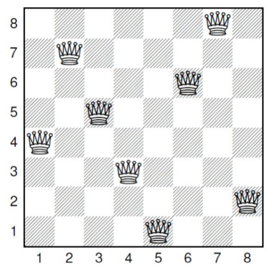
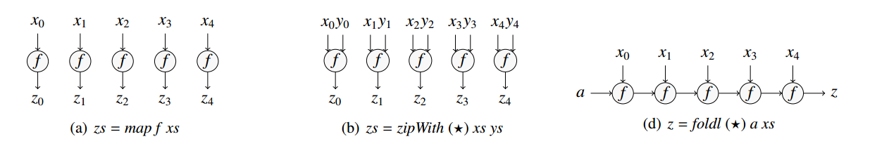

# N Queens on FPGA

* Author: [wenlonglv14@fudan.edu.cn](mailto:wenlonglv14@fudan.edu.cn)
* Student ID: 14210720082
* Last Modified:2015年11月07日 星期六 23时07分14秒 六

[TOC]

## 设计目标

* 参考[这篇paper](http://doc.utwente.nl/94663/), 使用Haskell求解N皇后问题
* 将Haskell编写的代码, 使用CLaSH编译为可综合的verilog代码, 并自动生成testbench
* 使用modelsim对由Haskell自动生成的testbench进行测试
* 使用DC compiler将verilog代码综合为门级网表
* 使用FDE进行map, pack, place, route, 生成bit文件
* 使用VeriInstrument上的虚拟外设, 对bit文件进行测试

## N皇后问题

N皇后问题定义如下: 在一个N×N的国际象棋棋盘上, 放置N个皇后(Queen)棋子, 要求这N个皇后互相都无法攻击到对方. 要如此, 则任意两个皇后都不能在同一行、同一列或同一斜线上. 目前尚无确定的公式, 可以求解N皇后问题解的数目. 

以N=8为例, 8×8的棋盘上, 8个皇后共有4,425,165,368种摆法, 但是满足8皇后问题要求的解只有92个. 下图为8皇后问题的一个解: 

<center>

</center>

对于N皇后问题, 我们以一个长度为N的向量表示一个解, 以上图为例, 以每一列中皇后所在行的位置组成解向量, 则上图对应的解为`<4,7,5,3,1,6,8,2>`


## Haskell与CLaSH

关于CLaSH的paper曾发表在2012年的FPL会议, 因此我的report writing是做的关于CLaSH的调研, 在其中会有对Haskell与CLaSH更详细的介绍, 在这一节仅作简单的介绍. 

### Haskell

Haskell是一门**纯函数式语言**, 在Haskell中, 所有的函数都是纯函数(pure function), 因而具有引用透明(reference transparency)的优点. 像IO操作, 文件读取等带有副作用的操作, 通过`IO Monad`进行.

因为Haskell中的函数都是纯函数, 状态与副作用必须被显式的操作, Haskell代码具有天然的**并行性**. 

**函数式编程**是Haskell唯一支持的编程范式, 函数是一等公民, 可以作为参数传入另一个函数, 也可以作为函数的返回值返回. 接受函数作为参数的函数叫做高阶函数, 许多高阶函数都可以作为Design Pattern使用. 

Haskell中的函数都是curry函数, 即是说, 可以认为Haskell中的函数都是单输入函数, 而多输入的函数, 可以理解为一个返回类型为函数的单参数函数, 举例来说, 我们定义两个数相加的函数`add`

```haskell
add :: Int -> Int -> Int
add x y = x + y
```

上面`add`函数的类型为`Int->Int->Int`, 可以理解为输入两个整数, 返回一个整数. 同时, 可以认为`->`是右结合的, 则`add`的类型也可以理解为`Int->(Int->Int)`, 即输入一个整数, 输出一个整数到整数的函数, 这样, 我们可以对`add`函数进行部分应用

```haskell
add3 :: Int->Int
add3 = add 3
```

Haskell是一门**强类型语言**, 所有函数的类型都必须在编译时确定, 并且不允许隐式类型转换. 但是Haskell支持自动类型推导, 即使不写出函数的类型, 编译器也可以自己推导出函数类型. Haskell有一套强大的**类型系统**, 与面向对象的类型系统不同, Haskell采用代数数据类型(Algebra Data Type), 倡导类型的组合(compose)而非面向对象方法中的继承(inherit). 下面是Haskell中常用的`Maybe`类型, 可以用来表示“可能失败的计算”

```haskell
data Maybe a = Nothing | Just a  -- Defined in ‘GHC.Base’
```

当一次计算的结果有意义时, 可以将值表示为`Just a`, 否则, 表示为`Nothing`, 这与`boost`库中的`optional`库类似. 例如, 可以定义取列表第一个元素的函数`headMaybe`:

```haskell
headMaybe []     = Nothing -- 如果空列表, 则返回Nothing
headMaybe (x:xs) = Just x  -- 如果列表非空, 则返回用Just封装的列表头元素. 
```

`Maybe`在本次设计中, 常被用作使能信号. 当一次计算需要数个时钟周期, 而时序电路尚未完成计算时, 输出端口输出`Nothing`, 否则, 输出`Just`封装的值. 

Haskell可以通过类型变量来实现泛型编程, 通过类型类(type class)来实现类似java中的接口(interface). 许多类型类具有很强的表达能力, 例如单子(`Monad`), 可以用来抽象IO操作(`IO Monad`)、状态与副作用(`State Monad`)、异常处理(`Either Monad`).  

### CLaSH

CLaSH是荷兰屯特大学的CAES(Computer Architecture for Embeded Systems)组的一个研究项目, 全称是***CAES Language for Synchronous Hardware***, 它利用Haskell编译器GHC作为前端, 可以将Haskell编译成verilog, systemverilog与VHDL. 

严格的说, CLaSH不能算作高层次综合(HLS, High Level Synthesis), 而仍然算作硬件描述语言(HDL, Hardware Description Language), 在CLaSH中, 如果一个函数不是高阶函数, 则一个函数就确定的对应一个电路模块. 一个一般的函数, 如`Int->Int->Int`这样的接受两个整数, 返回一个整数的函数, 生成的电路为组合逻辑电路. 而要描述时序电路, 则需要通过`Signal`类型. 一个`Signal`可以理解为一个无穷长的信号序列, 记录了一个信号的变化历史, 即从按下复位键后每个时钟沿的信号值. 因为要求显式的操作状态, Haskell的纯函数十分适合描述组合逻辑, 并且由Haskell生成的组合电路具有天然的并行性. 


对于具有清晰的数学描述的时序电路, 在CLaSH中可以用接近其数学表述的语法进行描述, 例如, 一个FIR滤波器可以描述如下: 

```haskell
fir coeffs xs = dotp coeffs (window xs)
  where dotp as bs = sum $ zipWith (*) as bs
```

在上面的示例中, 先定义了`dotp`函数, 实现两个向量的点乘(dot product), 这个函数在被调用时会被实例化为一个组合电路. 而`window`函数是一个内置函数, 其作用是对一个信号序列加窗口, 其函数类型为:

```haskell
window :: (KnownNat n, Default a) => Signal a -> Vec (n + 1) (Signal a)
```

并不是所有的时序电路都能用简单的数学表达式进行描述, 对于一些复杂的状态机, CLaSH提供了`mealy`, `moore`这两个高阶函数进行描述. 这两个函数的函数类型如下:

```haskell
mealy :: (s -> i -> (s, o)) -> s -> (Signal i -> Signal o)
moore :: (s -> i -> s) -> (s -> o) -> s -> (Signal i -> Signal o)
```

Haskell的一个优点是, 函数的类型往往就可以作为函数的文档, 上面两个函数的类型签名就体现了这一优点. `mealy`函数接受两个参数, 其中, 第一个输入的类型为`(s -> i -> (s,o))`, 其中, `s`, `i`, `o`均为类型变量, 可以粗略(并不准确)的类比c++中的模板参数. 表示这个函数接受一个状态类型, 一个输入类型, 返回一个新的状态类型量和一个输出类型量; `mealy`函数的第二个参数, 表征一个初始状态. 接受这两个参数后, `mealy`函数返回一个`(Signal i -> Signal o)`类型的函数, 可以看出, 这个函数的输入与输出均为`Signal`类型, 是一个时序电路. 

`mealy`函数的类型签名, 与数字电路中的米利模型是一致的: 当前时刻的状态与输入, 决定输出以及下一时刻的状态, `(s -> i -> (s,o))` 类型的参数就是描述这一行为的函数, 而后再提供一个复位时的初始状态, `mealy`函数就会自动生成对应的状态机. 

`moore`函数与`mealy`函数类似, 也是一个高阶函数, 不过它是与摩尔模型一致, 因此要求提供一个由当前状态和输入决定下一时刻状态的函数, 一个由状态决定输出的函数, 和一个初始状态. 

有一些Haskell的语法是无法综合为电路的, 包括: 

* 在组合逻辑中, 不支持递归函数
* 不支持列表、树这样的递归数据类型, 但是支持定长的vector
* 不支持浮点数操作, 但是有内置定点小数支持. 

CLaSH还可以自动生成testbench, 只要声明一个名为`testInput`的`Signal`类型变量, 就可以自动生成以`testInput`为激励源的test bench, 还可以通过声明`expectedOutput`这个`Signal`类型变量来对激励的输出进行验证. 

## 基于CLaSH的N皇后问题的硬件实现

### 列表与高阶函数

Haskell中, 列表是一个很基本的数据结构, 它是一个递归定义的数据结构, 其定义如下: 

```haskell
data [] a = [] | a : [a]        -- Defined in ‘GHC.Types’
```

一个元素类型为`a`的列表, 要么是个空列表(`[]`), 要么是通过把一个`a`类型的元素添加到一个`[a]`类型的列表头部获得. 

很多有用的高阶函数都围绕列表定义, 如`map`,  `filter`,  `zipWith`, `fold`等, 这几个高阶函数在N皇后问题实现时经常使用, 因此事先介绍一下. 不过, 这些高阶函数并非只能定义在列表上, 它们都是多态函数, 例如, `fold`不仅可以对列表做规约, 也可以对其他数据结构, 例如tree等进行规约, 而下面只介绍它们在列表上的实现. 

`map`函数把一个列表映射到另一个列表, 它接受一个映射函数, 和一个列表, 并对列表中的每一个元素应用映射函数, 返回的生成的新列表. 其函数类型签名与在列表上的大致实现如下: 

```haskell
map :: (a -> b) -> [a] -> [b]   -- Defined in ‘GHC.Base’
map _ []     = []
map f (x:xs) = f x : map f xs
```

`filter`函数可以用来筛选滤一个列表, 它接受一个谓词判断函数和一个列表作为参数, 对列表中的每个元素应用判断函数, 并将所有判断为真的元素组成新的列表返回. 它的函数签名以及大致实现如下: 

```haskell
filter :: (a -> Bool) -> [a] -> [a]
filter _ []   = []
filter p (x:xs)
  | p x       = x : filter p xs
  | otherwise = filter p xs
```

我们可以利用`filter`函数来实现QuickSort算法, 代码如下, 其中, `++`为列表拼接操作符, `(<x)`与`(>=x)`为两个谓词函数. 

```haskell
qsort [] = []
qsort (x:xs) = filter (< x) xs ++ [x] ++ filter (>= x) xs
```

`foldl` 对列表进行规约操作, 其大致实现如下, 它接受一个规约函数, 一个初始值, 然后据此进行规约, 最终返回一个与初始值相同类型的规约值. 还有一个与`foldl`类似的函数`foldr`, 其区别在于`foldl`对列表从左到右进行规约, 而`foldr`从右到左. 

```haskell
foldl :: (b->a->b) -> b -> [a] -> b
foldl op init []     = init
foldl op init (x:xs) = foldl op init' xs
  where init' = op init x
```

`foldl`常常用来实现遍历列表, 并返回一个值的操作, 例如, 对`Bool`类型列表求与、或, 对数字类型列表求和、求积: 

```haskell
and xs = foldl (&&) True  xs
or  xs = foldl (||) False xs
mul xs = foldl (*)  1     xs
sum xs = foldl (+)  0     xs
```

`zipWith` 取一个函数和两个列表作为输入, 并通过输入函数将两个列表组合成一个新的列表, 其大致实现如下: 

```haskell
zipWith :: (a -> b -> c) -> [a] -> [b] -> [c]
zipWith _ _ []          = []
zipWith _ [] _          = []
zipWith f (x:xs) (y:ys) = (f x y) : (zipWith f xs ys)
```

例如, `zipWith (+) [1,2,3] [4,5]`的结果为`[(1+4),(2+5)]`, 即`[5,7]`, `zipWith`并不要求两个列表的输入长度相等, 其返回的列表长度等于两个输入列表中长度较短的那个. 

### 定长列表及高阶函数的硬件表示

列表是一个递归数据类型, 在CLaSH中, 是无法综合成电路的. 在CLaSH中定义了定长的`Vec`数据类型, `Vec n a`表示一个长度为`n`, 元素类型为`a`的向量, 其中, `n`是一个在编译时确定的数. 

在`Data.Sized.Vector`模块中, 定义了一些作用在`Vec`上的高阶函数, `map`, `foldl`, `zipWith`都在其中, 它们的函数类型如下: 

```haskell
CLaSH.Prelude> :t map 
map :: (a -> b) -> Vec n a -> Vec n b

CLaSH.Prelude> :t foldl 
foldl :: (b -> a -> b) -> b -> Vec n a -> b

CLaSH.Prelude> :t zipWith 
zipWith :: (a -> b -> c) -> Vec n a -> Vec n b -> Vec n c
```

`filter`函数是无法实现在`Vec`类型上的, 因为`Vec`是在编译时就知道长度的定长向量. 

`map`, `foldl`, `zipWith`都是可以实现为模拟电路的, 它们对应的电路结构如下图所示: 



### 模拟变长列表

在CLaSH中, 只支持固定长度的`Vec`类型, 但是, 在求解N皇后问题时, 会需要一个长度可变的容器. 为此, 我定义了一个可变长度列表类型`QVec`, 由一个固定长度为`MaxSize`的`Vec`向量, 和一个整形长度指针组成, 并围绕`QVec`定义了`push`,`pop`,`top`等函数, 以便方便将其用作一个栈(Stack). 因为需要用到“在1至N这N个位置中, 筛选其中满足要求的棋子位置, 也围绕`QVec`定义了一个`filter`函数, 名为`hwFilterL`. 它们定义如下:

```haskell
type MaxSize = 5
data QVec a  = QV {
    list  :: Vec MaxSize a
    , len :: Size
} deriving(Eq)


isEmpty :: QVec a -> Bool
isEmpty v = len v == 0

top :: QVec a -> a -- won't check empty stack
top qv = list qv !! (len qv - 1)

pop :: (Default a) => QVec a -> QVec a  -- won't check empty stack
pop (QV list len) = QV (replace (len-1) def list) (len - 1)

push :: a -> QVec a -> QVec a  -- won't check full stack
push ele (QV list len) = QV newList (len+1)
  where newList = replace len ele list

hwFilterL :: (Default a) => (a -> Bool) -> QVec a -> QVec a
hwFilterL pred = foldlFilter . zipFilter pred
```

在上面的定义中, `pop`与`hwFilterL`都对`QVec`元素的类型做了约束, 即`Default a`, 即使说, 可以应用`pop`, `hwFilterL`函数的`QVec`容器, 其中的元素必须是实现了`Default`这个类型类,或者说借口, `Default`的定义如下, 实现了`Default`类型类的类型, 都会有一个该类型的`def`常量, 表示这个类型的默认值, 因为`pop`与`hwFilterL`底层仍然是一个定长向量, 因此, `pop`与`hwFilter`空出的元素, 用`def`来填充. 

```haskell
class Default a where
  def :: a
        -- Defined in ‘Data.Default.Class’
```

在类型签名中, 使用类型变量做占位符来实现多态, 这与c\+\+中的template类似, 但是在Haskell中, 可以对类型施加约束, 这是template目前无法做到的, 在c\+\+17中将会加入的`Concept`, 就是受了Haskell中类型类的启发. 

### N皇后问题的实现

因为本次设计期望解决的最大棋盘大小为8, 则整数类型至少要能够表征1至8, 所以用4位无符号数表示整数以及棋盘大小, 使用`type`定义`Size`以及`QInt`这两个类型别名(类似C语言中的`typedef`)

```haskell
type Size = Unsigned 4 -- size of QVec
type QInt = Unsigned 4 -- regular int
```

我们以棋盘中, 每一列棋子所在行的位置组成的向量表示一组解, 以N = 5为例, 可以用一个长度为5的`QVec QInt`类型向量表示一个5皇后问题的排列方案, 而可以用一个长度为n(n <=5)的向量, 表示5皇后问题中, 前n列的排列方案. 在此基础上, 我们定义`safeAll`函数, 用来判断已知前n列的一个排列时, 放在第n+1列的某行的皇后是否能够被前n列攻击到, 例如, 当前三列的排列方案为`<3,1,4>`时, 下一列放在第2行, 则判定安全, 返回`True`, 即`safeAll <3,1,4> 2 == True`, 放在第5行, 则判定不安全, 即`safeAll <3,1,4> 5 == False`. 

```haskell
safeAll :: QVec QInt -> QInt -> Bool
safeAll qv@(QV qlist qlen) p = foldl (&&) True zipped
  where zipped :: Vec MaxSize Bool
        zipped = zipWith (safe qlen p) qlist indexVec


safe :: Size -> QInt -> QInt -> QInt -> Bool
safe qlen p q idx  = (idx > qlen) || (p /= q && delta p q /= (qlen - idx + 1))
  where delta a b = max a b - min a b
```

定义了`safeAll`函数后, 假定我们已经有了一个前n列的摆放方式`qs`, 我们就可以使用`hwFilterL`函数, 筛选出第n+1列中从1到N所有对`qs`没有威胁的棋子, 组成一个集合`ps`:

```haskell
-- type MaxSize = 8 -- denote the max size allowed for a vertor(list)
-- indexVec :: Vec MaxSize QInt
-- indexVec = 1:>2:>3:>4:>5:>6:>7:>8:>Nil
-- bSz是棋盘大小boardSize, 也就是N皇后问题中的N
ps = hwFilterL (safeAll qs) (QV indexVec bSz)
```

上面的代码中, `qs`的类型为`QVec QInt`, 表示一个已知的安全的排列方式, 使用`qs`对`safeAll`进行部分应用, 则`safeAll qs`的类型为`QInt->Bool`, 用作`hwFilterL`的谓词判断函数, `QV indexVec bSz` 为供筛选的列表, 表示<1,2,3..N>这样一个列表. 


有了上面的铺垫, 我们可以来考虑如何实现N皇后问题, 首先, 我们定义一个**栈**, 栈中的元素类型, 是两个自定义的`QVec`类型的变长列表, 记作`(qs,ps)`, 栈中的每一个`(qs,ps)`满足这样的关系:对N皇后问题, 令`qs`长度为`nq', `ps`长度为`np`, 则`qs`表示一个已经确定其中棋子安全的前`nq`列棋子摆放, 而`ps`中的任意一个棋子, 都不会对`qs`中的棋子造成威胁, 即使说, 可以直接`push`进`qs`中而得到的新的`qs'`仍然是一个安全的拜访. 则当`qs`长度`nq`等于N时, 我们就找到了N皇后问题的一个解. 我们定义`Stack`这个类型别名如下: 

```
type Stack  = QVec (QVec QInt, QVec QInt)
```

在初始化时, 栈中只有一个元素, 其中`qs`为空列表, 而`ps`是一个从1到N的顺序列表, 显然, `ps`中的任一个元素, 都可以直接放入`qs`中. 我们寻找N皇后问题解的基本策略, 是不断从栈中`pop`出`(qs,ps)`,令栈容量减一, 然后从`ps`中`pop`处一个元素加入`qs`中成为`qs'`, 此时`qs'`仍是一个安全摆放方式, `(qs, (pop ps))`也是一个满足循环不变式要求的栈元素, 可以记作`top'`. 调用刚刚提到的`ps = hwFilterL (safeAll qs) (QV indexVec bSz)`, 找出对`qs'`安全的棋子列表`ps'`, 则得到一个新的栈元素`(qs',ps')`, 记作`newtop`, 根据具体条件, 判定是否将`top'`与`newtop`加入栈中. 每次当`qs'`长度等于棋盘大小时, 我们就找到了一个N皇后问题的解. 

我们定义状态机的状态、输入、输出类型: 

```haskell
data QState = QS { boardSize :: Maybe Size , stack::Stack , flag :: Bool } deriving(Eq, Show)
data QOut   = QOut { solution  :: Maybe (Vec MaxSize QInt) , flagOut  :: Bool } deriving(Eq, Show)
type QIn    = Maybe Size

instance Default QState where
    def = QS { boardSize = Nothing , stack   = def , flag = False }
instance Default QOut where 
    def = QOut { solution  = Nothing , flagOut  = False }
```
对于状态机的状态`QState`, 我们用一个`Maybe Size`类型的量表示棋盘大小, 之所以使用`Maybe`, 是因为棋盘大小由用户输入, 在未得到用户输入时, 棋盘大小为`Nothing`; 用一个`Stack`类型量用作栈, 最后, 添加一个`Bool`类型的flag量, 这个量在开发过程中用来debug, 在最终用于表示搜索已经完成, 所有的解都已找到. 

对于输出的类型`QOut`, 用一个`Maybe (Vec MaxSize QInt)`表示N皇后问题的解, 当仍在搜索时, 输出为`Nothing`, 每当找到一个解, 就会把解用`Just`封装后输出, 供后面的输出模块解析. `Bool`类型的`flagOut`, 表示搜索已经完成. 

用一个`Maybe Size`的量来表示用户输入的棋盘大小, 用户没有输入时为`Nothing`, 输入后变为有效值. 

`QState`与`QOut`都实现了`Default`类型类, 即`def::QState`与`def::QOut`分别表示按下Reset后的状态与输出. 

则使用米利模型定义的状态机`queenMealyM`如下, 可以看到, 其类型为`queenMealyM :: QState -> QIn -> (QState, QOut)`, 即状态+输入决定输出与下一时刻状态, 这正是米利模型的定义. 

```haskell
queenMealyM :: QState -> QIn -> (QState, QOut)
-- Finished!
queenMealyM qs@(QS _       _  True)  _        = (def{flag=True},  def{flagOut=True}) 
-- waiting
queenMealyM qs@(QS Nothing _  False) Nothing  = (def,def)                            
-- user initialize boardSize
queenMealyM qs@(QS Nothing _  False) (Just s) = (initState, def)                     
  where initState = def{boardSize = Just s, stack = def <~~ (def, QV indexVec s)}
-- searching
queenMealyM qs@(QS (Just bSz) stack False) _                                         
  | len stack == 0 = (def{flag = True}, def{flagOut = True}) -- finished
  | otherwise      =
      let (qs, ps) = top stack
          rest     = pop stack
          qs'      = qs <~~ top ps
          ps'      = hwFilterL (safeAll qs') (QV indexVec bSz)
          top'     = (qs,pop ps)
          newtop   = (qs', ps')
          (flag, stack') 
            | len qs' == bSz && (len ps == 1)                   = (False, rest)
            | len qs' == bSz && (len ps >  1)                   = (False, rest <~~ top')
            | len qs' <  bSz && (len ps == 1) && (len ps' == 0) = (False, rest)
            | len qs' <  bSz && (len ps == 1) && (len ps' >  0) = (False, rest <~~ newtop)
            | len qs' <  bSz && (len ps >  1) && (len ps' == 0) = (False, rest <~~ top')
            | len qs' <  bSz && (len ps >  1) && (len ps' >  0) = (False, rest <~~ top' <~~ newtop)
            | otherwise = (True, def)
          out  
            | len qs' == bSz = QOut{solution = Just (list qs'), flagOut = False}
            | otherwise      = QOut{solution = Nothing,  flagOut = False}
          state' = QS (Just bSz) stack' flag
       in (state', out)
```

定义好状态机之后, 使用高阶函数`mealy`生成时序电路:

```haskell
queensMealy = queenMealyM `mealy` def
```

生成主要的时序电路后, 剩余的工作就是一些接口设计工作, 如七段数码管的接口, 输入按键的借口. 不再赘述. 

## 遇到的问题

在本次设计中, 还是遇到了一些问题. 

主要的问题是CLaSH生成N皇后求解电路规模过大, 最初先求解5皇后问题时, 进展相当顺利, 从决定选题开始, 上午读完paper, 下午写代码实现, 晚上就已经可以在FDE开发板上运行了, 而之后当试图从5皇后迁移到8皇后(进而到用户自己输入棋盘大小)时, 却发现生成的电路规模, 已经无法完成place(经验是DC生成的门级网表在500KB以下时, 仍然使能够place, route的). 之后大部分时间都是花在从5皇后问题迁移到8皇后问题. 最初的想法是, 在DC compiler中增加面积约束, 但是往往生成的gate文件无法正常工作, 甚至曾经综合后DC compiler把所有的输出端都直接置零或置一的情况, 这可能是因为我对DC compiler的使用仍不熟悉, 冒然添加优化选项导致. 

后来发现, 我最初的电路是采用摩尔模型设计, 这最初是因为觉得摩尔模型的输出只由状态决定, 更加稳定. 后来试验发现, 使用米利模型生成的电路综合后规模更小, 因此就把电路模型从摩尔模型改为米利模型. 这改动起来也很简单. `moore`要求提供一个类型为`QState->QIn->QState`的状态函数, 表征下一时刻状态由当前状态与输入决定, 和一个类型为`QState->QOut`的输出函数, 表征输出由状态决定. 只要把这两个函数稍加组合, 就可以得到`mealy`函数需要的`QState->QIn->(QState,QOut)`类型的函数.  在改用米利模型后, 对8皇后问题, 综合后的电路规模已经能够正常布局布线, 并能正常工作了. 

在设计时, 有时在Haskell自己的测试环境下测试通过, 生成的verilog(电路设计代码+testbench)在modelsim下也仿真通过, 但是生成的bit文件仍然会出现异常. 例如, 5皇后问题的解总是与实际正确解相差一个bit, 即1(0001)显示为5(1001), 0(0000)显示为4(1000), 4(1000)显示为5(1001),2(0010)显示为3(0011). 后来发现, route时采用breadth first模式, 电路可以正常工作. 不过这也让route的时间大大增加. 最终, 完成依次route需要近一小时, 这也使得debug或者更改设计成本极大. 

本次设计的输出接口比较简单, 每当找到一个解, 就直接在七段数码管上显示, 并且因为FDE开发板对管脚数量有限制, 只放了5个数码管, 对于棋盘大小大于5的情况, 也只能显示每个解中前5列的摆放. 并且在输出端没有放置分频器, 因此只能以较低时钟频率显示. 这也使得演示较大棋盘的搜索过程更加困难, 因为对N=8的过程, 有92个解, 而总共耗费1965个时钟周期, 而对N=4, 只需要十几个周期就可以完成搜索, 如果要加分频器, 则必须对不同的棋盘设置不同的分频系数. 

一个更理想的做法, 应该是增加一块存储模块. 应该是在搜寻过程中, 以较高时钟频率搜索, 每找到一个解, 就将这个解存储, 待整个搜索过程完成后, 再以一个分频器从存储器中读数据显示, 此时可以采用诸如扫描管或者matrix这些更理想的显示方式. 之所以没有这样做, 是因为对于较大的棋盘(N=8), 使用寄存器存储则电路规模太大. 虽然FDE开发环境提供了Ram Generator, 但是因为时间关系, 没有实现. 
 
## 效果展示

可以在随本报告附加的视频文件进行查看. 
